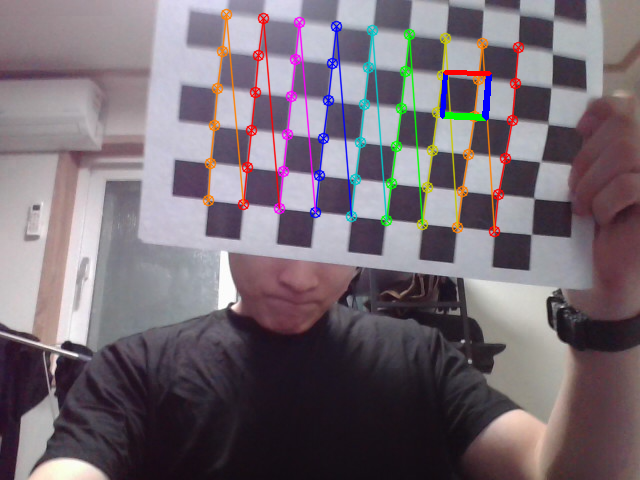

# 🎯 AR Pose Estimation using OpenCV

This project estimates the camera pose using a chessboard pattern and overlays a 3D AR object (a cube) onto the video stream in real time.

---

## 📌 Features

- Camera pose estimation using `solvePnP()`
- Real-time AR cube rendering on top of a detected chessboard
- Image and video capture of the AR result
- Implemented using OpenCV and Python

---

## 📷 Result Image

Below is an example frame showing the AR cube rendered on the chessboard:



---

## 🎥 Demo Video

Watch the video below to see the AR cube being rendered in real time as the chessboard moves:

[▶️ Click to watch demo_ar_pose.mp4](demo_ar_pose.mp4)

---

## 🛠️ How to Run

1. Clone the repository
2. Install dependencies:
   ```bash
   pip install opencv-python numpy
